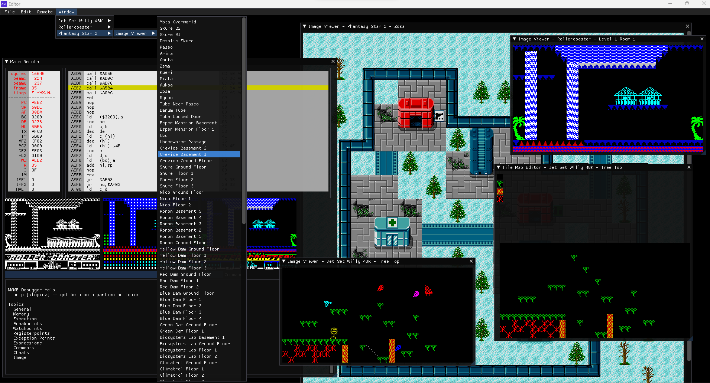

# Retro Editor Thingy - Very much WIP
## About
Plugin based editor, for working on creating hacks of old games. Uses libretro plugins to provide edit and play without requiring external emulators. Plugins are shipped in source form, allowing modifications / development directly in the editor.

## Current state

Not much more than a proof a concept at this point. It is capable of editing the ZX Spectrum game Jet Set Willy for the 48K spectrum, (can change the room layout tiles, but nothing more yet).

There is an initial tile image viewer for Phantasy Star 2 (Sega Megadrive/Genesis) (I have the sprites for maps mostly extracted, but not integrated here yet).

There is an initial pass on extracting the level layouts from Rollercoaster (ZX Spectrum).
There is an initial pass on extracting the level backgrounds from Fairlight (ZX Spectrum).
There is a Metroid (Nintendo Entertainment System) base plugin - it does nothing more than override the starting location at this point.

If building from source, there is a developer mode (although I intend to enable this in future), this adds another menu, that allows loading a custom fork of libretro mame.

## Documenting Formats

See the wiki for documentation on the data formats for supported games.

## TODO

Everything - I havevn't even settled on plugin formats, configs, builtins etc. 
