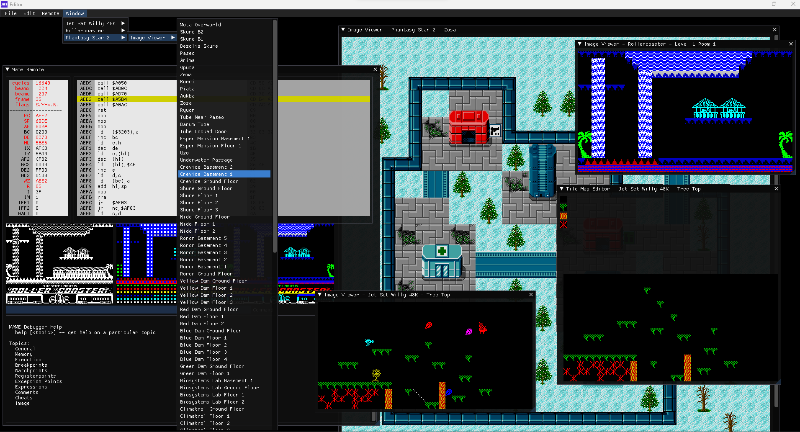

# Retro Editor Documentation Portal

Retro Editor is an attempt to create a multi game modding tool, for any [libRetro](https://www.libretro.com/) emulated system.

Plugins are distributed in source form, and are compiled by the editor on startup. This allows the development of plugins independant of the main
editor application.

## User Guide

If you are here because you want to use the editor to edit a game using an existing plugin, then follow this link : [User Guide](docs/user-guide.md).

## Developer Guide

If you want to develop a plugin or modify an existing plugin, the follow this link : [Developer Guide](docs/developer-guide.md)

## Editor Developer Guide

_under construction_